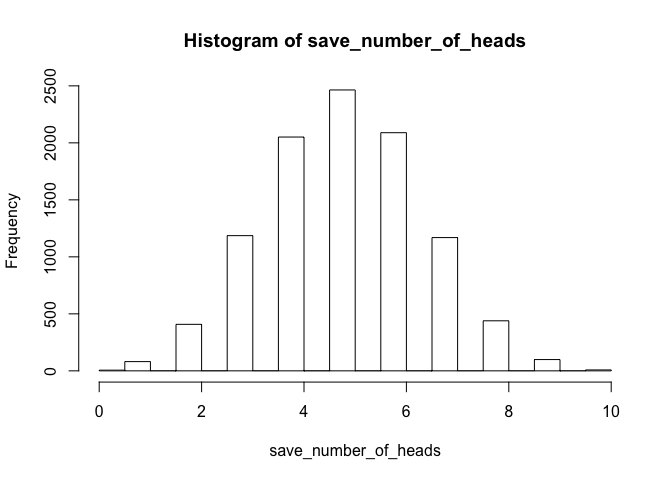
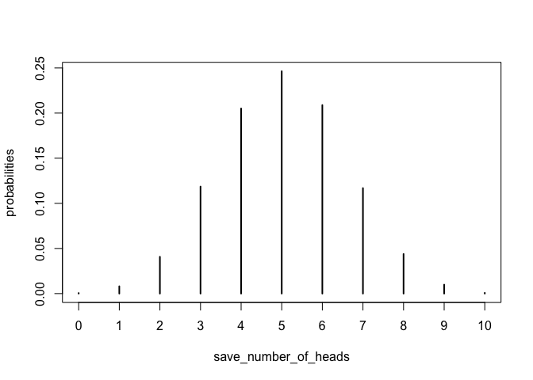

# Coin Flip simulator
Matt Crump  
September 9, 2016  

This is an R-markdown file, which combines two languages together allowing you to 1) write R-scripts, and 2) use markdown to make notes to yourself, display your code,  and display the results of your code in a webpage or other document, all in one place.

The code in this document is the same as in Example 4. The only difference is that Rmarkdown is used, and the output of the code can be viewed as an html file (load it up in your web-browser), or as an .md file (viewablw on github).

# Goals of this code

R can be used to run simulations. This code considers simulations of flipping a coin.

A fair coin will land 50% heads and 50% tails over the long run. We could simulate this in R by creating a vector. Vector's are used to store lists of numbers.

We could simulate heads and tails, by putting 1s (heads) or 0s (tails) into a vector. R comes with lots of existing functions that you can use. We can use the rbinom function to simulate a coin-toss. rbinom samples numbers from a binomial distribution (n = the number of observations, size = the number of trials, prob = probability of getting a 1 (success, or heads).


```r
flip_a_coin <- rbinom(n=1, size=1, prob=.5) # stores the result of one coin flip
```

Look inside the variable flip_a_coin, it will be a one or zero. If you re-run that whole line many times, the number should change to 1 or 0 randomly.

## let's flip the same coin 100 hundred times and store the result in a vector


```r
one_hundred_flips <- rbinom(n=100, size=1, prob=.5) # vector containing 100 1s and 0s
```

# How well did our simulation work? let's ask some questions

## 1. Did the above code actually produce 100 coin flips. 

If the answer is yes, then the vector should have 100 numbers in it, and that means the vector length will be 100. Check this:


```r
length(one_hundred_flips) #should return 100
```

```
## [1] 100
```

## 2. Are there approximately 50% heads and 50% tails?
We can find out by adding all the numbers together. The sum of all the numbers will tell us how many heads (1s). 100 minus the sum will tell us how many tails


```r
number_of_heads <- sum(one_hundred_flips)
number_of_tails <- 100 - number_of_heads

number_of_heads
```

```
## [1] 41
```

```r
number_of_tails
```

```
## [1] 59
```

# New question

Let's say you flip a fair coin ten times. Will you always get 5 heads and 5 tails? No. Sometimes you will get 6 heads and 4 tails, or maybe 7 tails and 3 heads, etc.

All of the different possibilities are have different probabilities of occurence. What are the probabilities of getting 0 heads, 1 head, 2 heads, 3 heads, etc. all the way to 10 heads?

We answer the question using monte-carlo simulation. This involves simulating flipping a coin ten times; over and over again, thousands of times. Each time we see how many heads we got out of 10. We save the number of heads every time, then we can determine how often each value occurs.


```r
save_number_of_heads <- c() # empty vector for saving results
for (i in 1:10000){
  # samples 10 numbers from a binomial distribution
  # finds the sum (number of heads out of 10)
  head_count<-sum(rbinom(10,1,.5))
  save_number_of_heads<-c(save_number_of_heads,head_count) #appends head_count to vector
}
```

### Across all 10,000 simulations, what was the average number of heads?

```r
mean(save_number_of_heads)
```

```
## [1] 5.0179
```

### How often did each of the possible numbers of heads occur?

```r
hist(save_number_of_heads) #shows a histogram in the plot window
```

<!-- -->

# What was the probability of each of the possible numbers

```r
table_of_counts<-table(save_number_of_heads)
probabilities <- table_of_counts/10000
plot(probabilities)
```

<!-- -->

